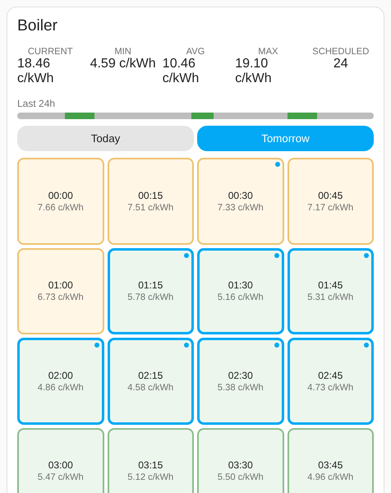

# Nordpool Scheduler Card

[](https://hacs.xyz/docs/faq/custom_repositories/)
[](https://github.com/klejejs/ha-nordpool-scheduler-card/releases)
[](https://github.com/klejejs/ha-nordpool-scheduler-card/actions/workflows/ci.yml)
[](LICENSE)

A Lovelace card for the [Nordpool Scheduler](https://github.com/klejejs/ha-nordpool-scheduler-integration) integration. Shows Nord Pool prices in 15-minute slots, shows and controls the scheduler's auto mode, and lets you click a slot to override it.



## Prerequisites

The [Nordpool Scheduler](https://github.com/klejejs/ha-nordpool-scheduler-integration) integration, set up with a scheduler entry, or a prices-only entry if you only want to see prices. This card reads and writes through it — it doesn't talk to Nord Pool directly.

## Installation

### HACS

[](https://my.home-assistant.io/redirect/hacs_repository/?owner=klejejs&repository=ha-nordpool-scheduler-card&category=plugin)

Or by hand:

1. HACS → the three-dot menu → **Custom repositories**
2. Add `https://github.com/klejejs/ha-nordpool-scheduler-card` with the category **Dashboard**
3. Install **Nordpool Scheduler Card**. HACS adds the dashboard resource for you.

### Manual

1. Download `nordpool-scheduler-card.js` from the latest release
2. Copy it to `config/www/nordpool-scheduler-card.js`
3. Settings → Dashboards → Resources → add `/local/nordpool-scheduler-card.js` as a JavaScript module

## Configuration

Add the card through the dashboard editor (search "Nordpool Scheduler"), or in YAML:

```yaml
type: custom:nordpool-scheduler-card
entity: sensor.nordpool_scheduler_boiler_electricity_price
name: Boiler # optional, defaults to the entity's name
show_name: true
show_history: true
show_day_tabs: false
hide_past_slots: false
density: normal # normal, compact or super_compact
hide_averages: [] # e.g. [week, year]
```

| Option | Type | Default | Description |
|---|---|---|---|
| `entity` | string | required | The scheduler's electricity price sensor, or its mirrored Schedule sensor on [another instance](#on-another-instance) |
| `name` | string | entity name | Card title |
| `show_name` | boolean | `true` | Show the card title |
| `show_history` | boolean | `true` | Show a 24h on/off history bar of the scheduler's target entity |
| `show_day_tabs` | boolean | `false` | Today/Tomorrow tabs instead of stacked sections |
| `hide_past_slots` | boolean | `false` | Leave out today's rows that have fully passed. The row with the current slot stays, so each row still starts on the hour |
| `density` | string | `normal` | How tightly the card is laid out. `compact` keeps four slots per row, one row per hour, but makes the slots short and the rest of the card smaller. `super_compact` goes further to fit a phone screen: eight slots per row, smaller text, and slot prices without the unit |
| `hide_averages` | list | none | Average prices to leave out of the row: `today`, `week`, `month`, `year`. Listing all four hides the row |
| `set_slots_service` | string | see below | For a mirrored scheduler only: the Remote Home-Assistant proxy service that sets slots |

### On another instance

The card can show a scheduler that runs on another Home Assistant instance and is mirrored into this one with [Remote Home-Assistant](https://github.com/custom-components/remote_homeassistant). Set up the other instance as the [integration's README](https://github.com/klejejs/ha-nordpool-scheduler-integration#another-home-assistant-instance) describes, then point the card at the mirrored Schedule sensor:

```yaml
type: custom:nordpool-scheduler-card
entity: sensor.darzs_nordpool_scheduler_boiler_schedule
name: Boiler
```

The card reads the schedule from that sensor's attribute, so it updates whenever Remote Home-Assistant mirrors a change. It works out the entity prefix (`darzs_` here) by comparing the sensor's ID with the one it has on the other instance, and uses it to find the mirrored auto mode switch and numbers and the target entity's history.

Clicking a slot calls `nordpool_scheduler.<prefix>set_slots`, e.g. `nordpool_scheduler.darzs_set_slots`. That is Remote Home-Assistant's proxy for `nordpool_scheduler.set_slots` when its service prefix matches the entity prefix. If you gave it a different service prefix, set `set_slots_service` to the proxy's full name.

The auto mode controls need the switch and numbers mirrored too, and the history bar needs the target entity mirrored and recorded on this instance. While the other instance is unreachable, Remote Home-Assistant removes its entities, and the card says so until they come back.

## Usage

Prices are shown in cents/kWh, VAT included.

### Auto mode

The chip in the header shows whether the scheduler's auto mode is on: blue with the hours per day when it is, grey "Auto off" when it isn't. Click it to turn auto mode on or off. The gear next to it opens a settings row with the same toggle and auto mode's hours per day, max price and cheap price. A price of 0 turns that limit off. Check **Hour range** to only pick hours between a start and an end time, for example 17:00 to 23:00; the chip then shows the range too. With the range on, **Cheap price all day** lets slots at or below the cheap price run outside it as well. Changes take effect at once. Check **Limit runs** to cap how many separate runs auto mode makes a day, for a target like a boiler that shouldn't start often; **Runs per day** at 1 runs the hours in one go, and the chip shows the limit. The hour range and the run limit each need a version of the integration that has them.

### Slots

The border shows what the slot will actually do: a thick blue border means the entity runs.

- A robot in the top-left corner marks a slot auto mode picked. It is only shown while auto mode is on.
- An orange hand in the top-right corner and a dashed border mark your own override. An override that runs the entity has an orange border.
- A faded robot next to the hand is an auto pick you overrode off.

Click a slot to override it to the opposite of what auto mode or the default state wants. Click an overridden slot to remove the override, and the slot follows auto mode or the default again.

The info bar counts the upcoming auto picks and your overrides while auto mode is on, and your overrides alone while it is off.

### Average price

The row under the info bar shows the average price while the entity was on so far today, this week, this month and this year, with how many hours it ran. For a prices-only entry it is the plain average price over the same periods. Leave some out with `hide_averages`. The values come from the integration's average price sensors, so the row needs a version of the integration that has them.

To show prices on a dashboard without scheduling anything, add a **Prices only** entry in the integration and point the card at its price sensor. That entry controls no entity, so the card only shows its prices: slots can't be clicked, and auto mode, the override count and the history bar are hidden.

Colors are relative to that day's own price range: green is cheap, red is expensive. A day with no published prices yet shows a placeholder instead of an empty grid.

## Development

```bash
yarn install
yarn build       # dist/nordpool-scheduler-card.js
yarn start       # rollup --watch, served on :5005
yarn lint        # eslint + tsc --noEmit
yarn format
```

Point a dashboard's Lovelace resource at `http://<dev-machine>:5005/nordpool-scheduler-card.js` while `yarn start` is running to iterate against a real Home Assistant instance.

## Releasing

Releases are made only through GitHub Releases. Pushing a tag on its own builds nothing.

Release Drafter keeps a draft release up to date on every merge to `main`. Its tag is the next minor version, or the next major one if a merged PR carries the `major` label. Its notes are grouped by PR label: `dependencies` (Renovate branches), `bug` (titles starting with "Fix") and `feature` (everything else). The labels are applied automatically when a PR opens, so relabel a PR before merging if it guessed wrong.

To release, publish that draft from the GitHub UI. If it should be a different version, change the tag, the release title and the "Full Changelog" link at the bottom of the notes together. The draft only fills them in once, so editing the tag alone leaves the other two pointing at the old version. The first release has no earlier one to count from, so set its version by hand.

Publishing runs the release workflow, which builds the card with the release's tag as its version and attaches `nordpool-scheduler-card.js` to the release. The card logs the version to the browser console. The version isn't stored anywhere in the code.

## License

MIT — see LICENSE.
